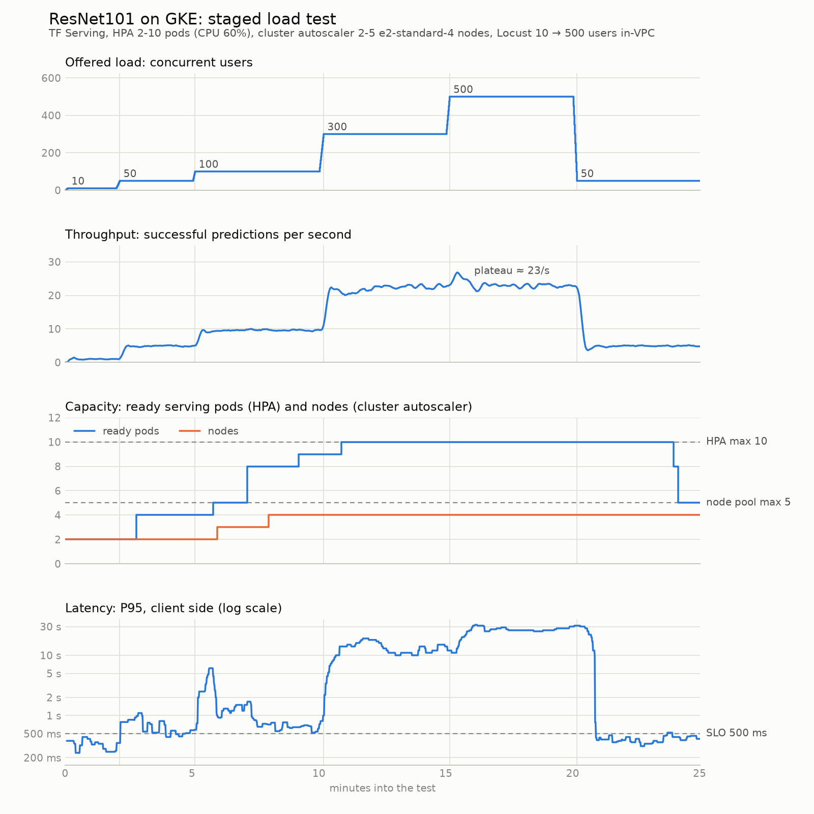
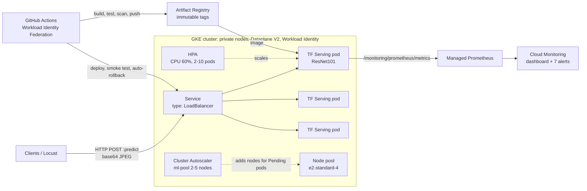

# Scalable ResNet101 Inference on GKE

[](https://github.com/sayem041088/ml-serving/actions/workflows/ci.yml)


[](LICENSE)

A production-style image-classification platform: an ImageNet-pretrained **ResNet101** served by
**TensorFlow Serving** on **Google Kubernetes Engine**. Capacity follows demand at two levels.
The **Horizontal Pod Autoscaler** adds model-serving pods as CPU rises, and the **GKE Cluster
Autoscaler** adds nodes when those pods no longer fit. Infrastructure is **Terraform**, delivery
is **GitHub Actions** with keyless authentication and immutable images, load comes from
**Locust**, and **Cloud Monitoring** shows what happened.

The project is built around measurement. Every design decision below is backed by a benchmark,
a load test or a failure observed on a real cluster, and several defaults turned out to be
wrong once measured.

<picture>
  <source media="(prefers-color-scheme: dark)" srcset="docs/images/gke-staged-scaling-dark.png">
  
</picture>

## Highlights

Measured on GKE, `e2-standard-4` nodes, in a 25-minute staged test (10 → 500 users):

- **Two-level autoscaling works end to end.** Pods scaled 2 → 10 and nodes 2 → 4. Pods waited
  **60-70 s** for a new node, provisioning included, then scaled back down after the load fell.
- **Zero errors up to saturation, and 0.22 % at ~2× overload.** No pod restarted, and the error
  SLO (< 1 %) held throughout.
- **Resilient to failures.** A crashed pod was replaced in **22 s** and a drained node recovered
  in **49 s**, with **100 %** of client requests succeeding during both.
- **Capacity ceiling ~23 images/s**, with an honest latency operating point of ~10 images/s at
  P95 ≈ 0.7 s. The measured bottlenecks and how to move them are in
  [docs/EXTENSIONS.md](docs/EXTENSIONS.md).
- **Eight problems found by measurement and fixed**, from a Keras 3 export that TF Serving
  couldn't load to a topology-spread setting that made each new pod demand a new node
  ([findings](#what-the-measurements-changed)).

## Architecture



**Request path.** Clients send image bytes, base64-encoded in JSON. Inside the exported model,
TensorFlow decodes the JPEG/PNG, resizes the shorter side to 256, centre-crops to 224×224,
applies the ImageNet mean subtraction, runs ResNet101, and returns the top-5 class ids, labels
and scores. Keeping pre- and postprocessing in the graph keeps clients trivial and payloads
small: ~80 KB per image instead of ~1 MB of JSON floats, and ~300 B responses.

```bash
curl -s -X POST http://<ENDPOINT>/v1/models/resnet101:predict -d @locust/test_payload.json
# {"predictions": [{"labels": ["military_uniform", "suit", ...], "scores": [0.767, 0.083, ...], "classes": [652, 834, ...]}]}
```

## How scaling works

```
traffic ↑ → pod CPU > 60 % of request → HPA adds pods (≈ 20 s to serve: model load + warmup)
         → nodes out of CPU requests → pods Pending
         → Cluster Autoscaler adds a node (≈ 40 s; image streaming avoids a full 1.4 GB pull)
traffic ↓ → HPA removes pods after a 180 s window → idle nodes drained one at a time (~10 min each)
```

**Sizing is what makes both levels work.** The HPA measures usage relative to the CPU
*request*, and the scheduler packs pods by request. With 1 CPU per pod, an `e2-standard-4` node
holds 3 serving pods, so 2 nodes fit 6 and the HPA maximum of 10 forces node scaling:

| CPU request | Pods per node | Pods on 2 nodes | Outcome at 10 pods |
|---|---|---|---|
| 500m | 6 | 12 | cluster autoscaler never runs |
| **1 CPU** | **3** | **6** | **7th pod Pending → node added** ✓ |
| 2 CPU | 1 | 2 | pods stuck Pending at the 5-node cap |

A policy test (`tests/test_manifests.py`) fails CI if this invariant breaks.

## Results

**GKE staged test** (client-side; full methodology and timelines in
[docs/BENCHMARKS.md](docs/BENCHMARKS.md)):

| Users | Images/s | P50 | P95 | Errors | Pods | Nodes |
|---|---|---|---|---|---|---|
| 10 | 1.0 | 220 ms | 280 ms | 0 % | 2 | 2 |
| 50 | 4.9 | 290 ms | 560 ms | 0 % | 4 | 2 |
| 100 | 9.6 | 320 ms | 660 ms | 0 % | 9 | 4 |
| 300 | 22.2 | 1.6 s | 11 s | 0 % | 10 (max) | 4 |
| 500 | 23.4 | 13 s | 26 s | 0.22 % | 10 | 4 |
| 50 (recovery) | 4.8 | 240 ms | 420 ms | 0 % | 10 → 2 | 4 → 2 |

What the numbers say:
- Throughput plateaus at **~23 images/s**. Three pods share each 4-vCPU node, so each gets
  ~1.2 cores rather than its 2-core limit.
- Under stress, the binding limit was **HPA `maxReplicas`, not nodes**: 10 pods fit on 4 of the
  5 allowed nodes.
- **P95 < 500 ms holds up to ~5 images/s.** Above that, CPU contention on shared nodes dominates.

**Single pod** (2-CPU limit): saturates at **5.2 images/s**, 210 ms for one request, ~450 MiB
of memory, and **18 s** from container start to serving (10 s of that is warmup).

## What the measurements changed

| Finding | Evidence | Change |
|---|---|---|
| TF sizes thread pools from the *node's* cores, not the CPU limit | 2.9 → **5.2 images/s** (1.8×) and 390 → 210 ms once pinned | `TF_INTRA/INTER_OP_PARALLELISM` = CPU limit, via ConfigMap |
| An L4 load balancer pins keep-alive connections to old pods | a pod added by the HPA served **2** requests while an original served **1,291**; the HPA saw a healthy 66 % *average* and stopped scaling | per-request connections in the load test; L7 Gateway listed as an extension |
| HTTP readiness probes queue behind inference under load | a healthy pod was pulled from rotation at P50 9 s, the start of a cascade | startup probe checks model AVAILABLE; readiness and liveness are TCP |
| Keras 3 + `tf.saved_model.save` loads in Python but **not in TF Serving** | `Could not find variable conv2_block1_1_conv/bias` | `keras.export.ExportArchive`; CI runs the real server |
| `ExportArchive.track()` stores every weight twice | 342 vs 171 MB; ~700 vs ~450 MiB per pod | removed; a test fails above 200 MB |
| TF Serving doesn't enforce signature shapes | a 10×10 image returned HTTP 200 with garbage | `tf.ensure_shape` → 400 |
| Soft topology spread left both replicas on one node after scale-down | observed on GKE, so one node failure would have been an outage | `DoNotSchedule`… |
| …and the default `nodeTaintsPolicy` counts tainted nodes as empty | each new pod demanded a new node | `nodeTaintsPolicy: Honor`; verified 6 pods → 2/2/2 |

## Design decisions

| Decision | Why | Alternative (see [EXTENSIONS](docs/EXTENSIONS.md)) |
|---|---|---|
| **TensorFlow Serving** over a FastAPI wrapper | optimized C++ runtime, versioning, warmup, batching and Prometheus metrics, with no serving code to own | FastAPI for business logic; Triton for multi-framework/GPU |
| **GKE Standard** over Vertex AI Endpoints | control over HPA policy, pod sizing, node pools, network policy and cost levers, which is what this project explores | Vertex AI or Autopilot for less operational load |
| **CPU-based HPA** | built in, easy to reason about, tracks a CPU-bound model well once traffic is balanced | request-rate or queue-depth metrics (already collected) |
| **Burstable pods** (request 1, limit 2 CPU) | 3 pods per node and burst headroom while new capacity arrives | Guaranteed QoS: steadier latency, half the density |
| **Zonal cluster** | exact node counts and lower cost for a demo | regional for production HA |
| **Model baked into the image** | an immutable artifact; one tag = code + weights | model on GCS with versioned rollout |

## Production readiness

- **Delivery.** CI runs lint, unit/policy tests, `terraform validate`, kubeconform, a
  from-source image build with integration tests against the real server, a Locust smoke test
  and a Trivy scan. CD authenticates through Workload Identity Federation (no keys), pushes
  immutable `sha-<commit>` tags, rolls out with zero capacity loss, smoke tests, and rolls back
  automatically.
- **Reliability.** ≥ 2 replicas with a hard spread across nodes, PDB `maxUnavailable: 1`, a
  startup probe gated on a warmed-up model, load-tolerant readiness/liveness probes, a `preStop`
  drain, surge node upgrades, and tested pod-kill and node-drain recovery.
- **Security.** Private nodes, Pod Security `restricted`, a non-root read-only container with all
  capabilities dropped, NetworkPolicy with **all egress denied**, no service-account token
  mounted, the GKE metadata server, Shielded VMs, SHA-pinned CI actions, immutable registry tags,
  and a least-privilege node service account by default.
- **Observability.** A Cloud Monitoring dashboard (throughput, P50/P95/P99, error rate by status,
  HPA desired/current, CPU % of request, nodes, Pending pods, restarts, logs) and 7 PromQL alerts
  with runbooks, all defined as code. Dashboard numbers were cross-checked against Locust (22.5 vs
  22.2 req/s).

## Tech stack

| Area | Tools |
|---|---|
| Model and serving | Keras 3 ResNet101 (ImageNet), TensorFlow 2.21, TensorFlow Serving 2.21 (REST + gRPC) |
| Platform | GKE 1.35 (Dataplane V2, image streaming, managed Prometheus), Artifact Registry |
| Scaling | Horizontal Pod Autoscaler (`autoscaling/v2`), GKE Cluster Autoscaler |
| IaC and config | Terraform (Google provider 8.x), Kustomize |
| Delivery | GitHub Actions, Workload Identity Federation, Docker Buildx, Trivy |
| Testing | pytest, Locust 2.46, kubeconform, kind (local Kubernetes) |
| Observability | Managed Service for Prometheus, Cloud Monitoring, Cloud Logging |

## Repository layout

```
├── model/              # download + export ResNet101 (2 signatures, warmup requests)
├── resnet_client/      # Python client: preprocessing, payloads, response validation, CLI
├── docker/             # serving image (multi-stage, model exported in-build) + Locust image
├── terraform/          # VPC, Artifact Registry, GKE, node pools, IAM, WIF, monitoring
├── kubernetes/         # Deployment, Service, HPA, PDB, NetworkPolicy, PodMonitoring, ...
├── monitoring/         # dashboard JSON + alert policies (applied by Terraform)
├── locust/             # load test + staged profiles + sample payload
├── scripts/            # deploy, smoke, load/chaos tests, metric recorder, summary, charts
├── tests/              # unit, policy, model, API and cluster tests
├── docs/               # deployment guide, benchmarks, extensions
└── .github/            # CI, CD, templates, Dependabot
```

## Quick start (local)

Needs Docker and Python 3.12. This serves the model on `localhost:8501`, as a 2-CPU pod would be served:

```bash
make install install-model    # Python deps (+ TensorFlow for the export)
make export-model             # download ResNet101, export model/resnet101/1
make build-local run-local    # build the TF Serving image and run it
make smoke-local test test-integration

python -m resnet_client predict locust/images/grace_hopper.jpg
#   76.7%  military_uniform
#    8.3%  suit
```

Deploying to GKE (Terraform, image push, rollout, CI/CD, load tests, teardown) is covered step by
step in **[docs/DEPLOYMENT.md](docs/DEPLOYMENT.md)**.

## Testing

| Layer | What | Where it runs |
|---|---|---|
| Unit | preprocessing, payloads, response validation, result summarizer | every CI run |
| Policy | manifest invariants (probes, security context, sizing vs node capacity, spread), dashboard/alert validity | every CI run |
| Model | client vs server preprocessing agreement, exported signatures, no duplicated weights | locally with TensorFlow |
| API | real TF Serving container: predictions, batches, 400/404 handling, metrics names | CI (image job), after deploy |
| Cluster | Deployment ready, HPA reading CPU, PDB, no crash loops | after deploy (`make k8s-test`) |
| Performance | staged / performance / spike Locust profiles + cluster recorder | on demand (`make load-test`) |
| Resilience | pod kill, node drain under traffic | on demand (`make chaos-test`) |

## Documentation

| Document | Contents |
|---|---|
| [docs/DEPLOYMENT.md](docs/DEPLOYMENT.md) | Step-by-step deployment: local, kind, Terraform, GKE, CI/CD, load tests, locked-down projects, teardown |
| [docs/BENCHMARKS.md](docs/BENCHMARKS.md) | Methodology and every measured result, with scaling timelines |
| [docs/EXTENSIONS.md](docs/EXTENSIONS.md) | What to build next, and the trade-offs of each option |
| [CONTRIBUTING.md](CONTRIBUTING.md) | Development workflow and checks |
| [SECURITY.md](SECURITY.md) | Reporting vulnerabilities; security design |

## Acknowledgements

ResNet101 ImageNet weights from [Keras Applications](https://keras.io/api/applications/). The
sample image (`grace_hopper.jpg`) is a public-domain U.S. Navy photograph, distributed with the
TensorFlow examples.

## License

[MIT](LICENSE) © 2026 sayem041088
